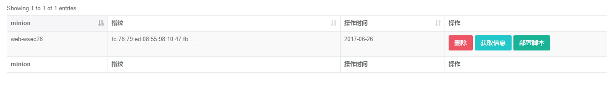

# OMS环境需求:
<pre>
python 2.7.x
django 1.7.11
requests
IPy
PyYAML
</pre>

# salt_api.conf：
<pre>
external_auth:
  pam:
    test:
      - .*
      - '@wheel'
      - '@runner'
      - 'grains.*'
      - 'status.*'
      - 'sys.*'
      - 'test.*'

rest_cherrypy:
  port: 7000
  host: 0.0.0.0
  ssl_crt: /etc/ssl/private/cert.pem
  ssl_key: /etc/ssl/private/key.pem
  webhook_disable_auth: True
  webhook_url: /hook
</pre>
# 创建数据库及创建用户
<pre>
./manage.py makemigrations
./manage.py migrate
./manage.py createsuperuser
</pre>

# 通过salt-api添加服务器

# 系统设置
# git仓库设置
# saltstack功能介绍
# 安装软件包
